# Build guide

## 1 Parts Cut

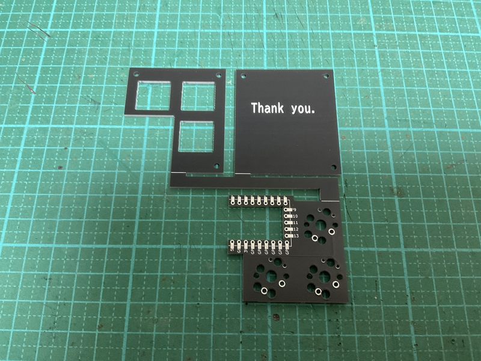

Cut the white line with nippers.
 
白線をニッパーなどで裁断してください。
 

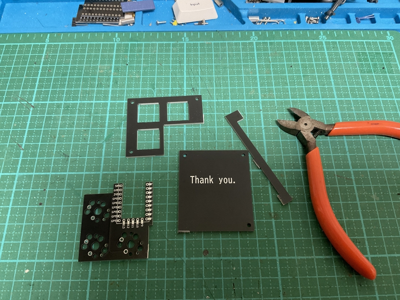

File the waste away.
 
無駄な部分をやすりがけしてください。
 

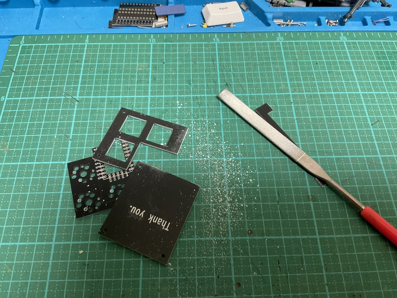

## 2 Black paint

It looks better if you paint the sides with a black pen.
 
側面を黒色ペンで塗ると見た目が良いです。
 

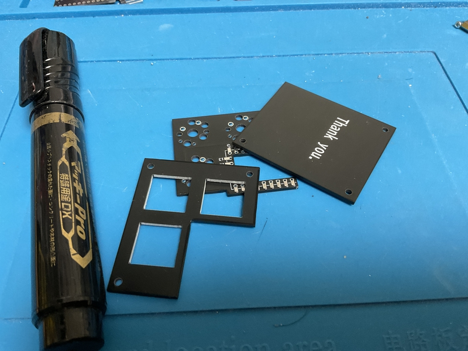

## 3 Switch soldering

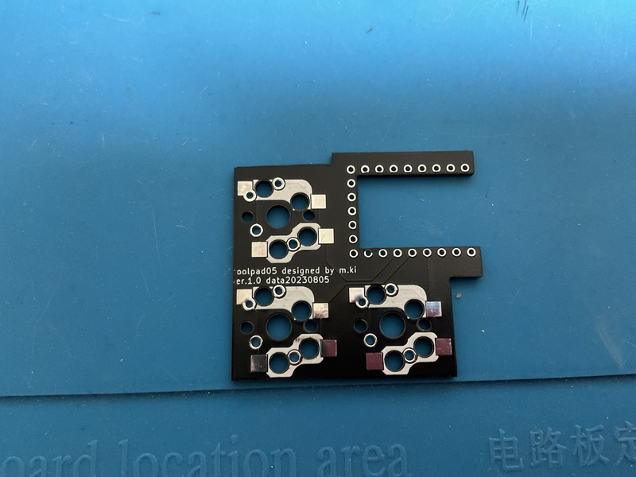

PCB can be switch socket or direct soldered.
 
PCBはスイッチソケットまたは、直接はんだ付けの選択ができます。
 
 
Here, we will do how to attach a switch socket.
 
ここでは、スイッチソケットをつける方を行います。
 

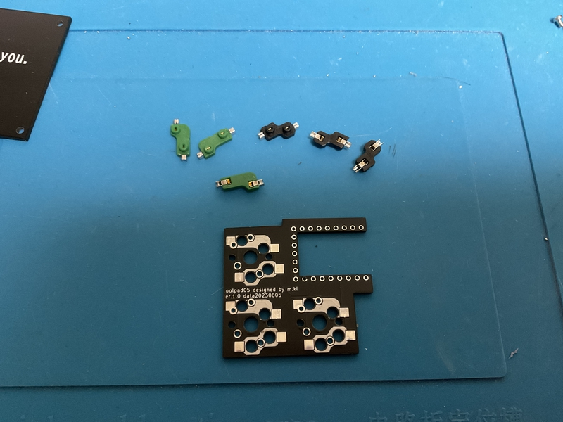

Green is cherryMX, black is choc switch socket. You can wear both or just one.
 
緑色はcherryMX、黒色はchocのスイッチソケットです。両方つけることも、片方だけつけることもできます。
 

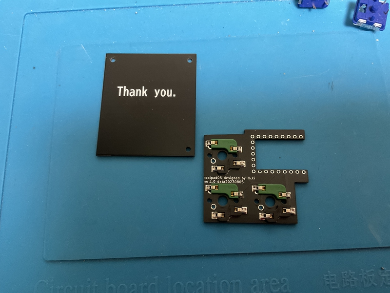

## 4 MCU soldering

Solder the RP2040-Zero. It's okay to use console.
 
RP2040-Zeroをはんだ付けします。コンスルーを利用しても大丈夫です。
 

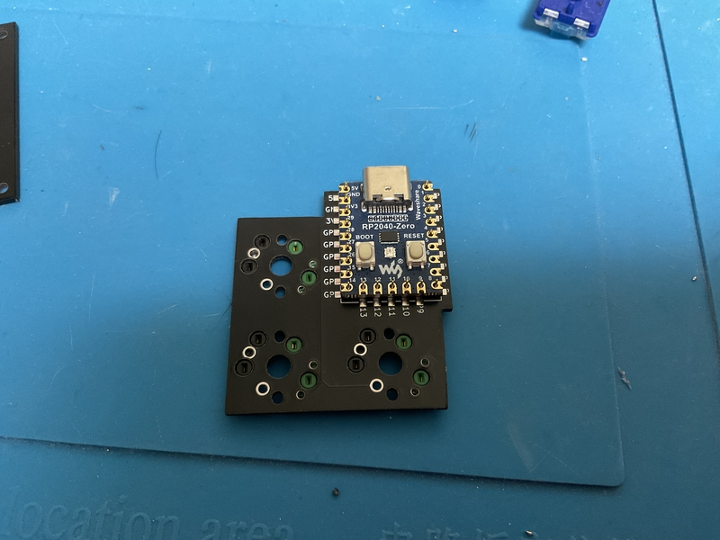

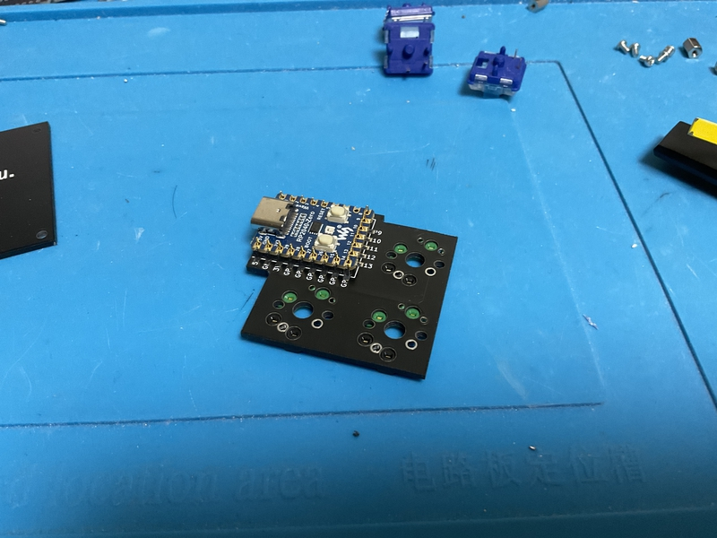

## 5 Making bottom plate 

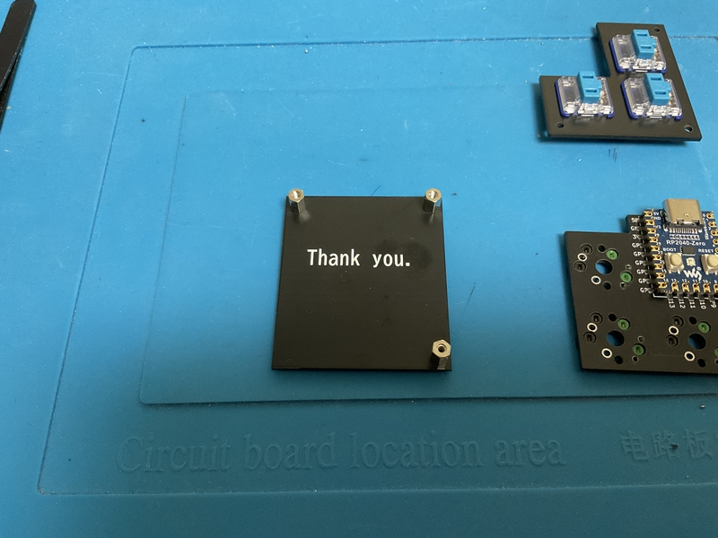

Insert an M2 screw (3mm) from the bottom surface of the bottom plate and fix it with an M2 spacer (6mm) on the top surface.
 
ボトムプレートの下面からM２ネジ（3mm）を挿入して、上面でM２スペーサー（6mm）で固定します。
 

## Insert key switch

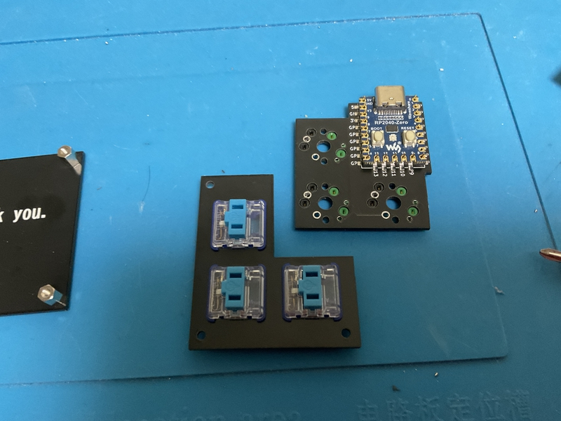

Insert the key switch into the switch plate. Note the orientation.
 
スイッチプレートにキースイッチを挿入してください。向きに注意してください。
 
 
Then insert the key switch into the switch socket on the PCB.
 
その後、キースッチをPCBのスイッチソケットに挿入してください。

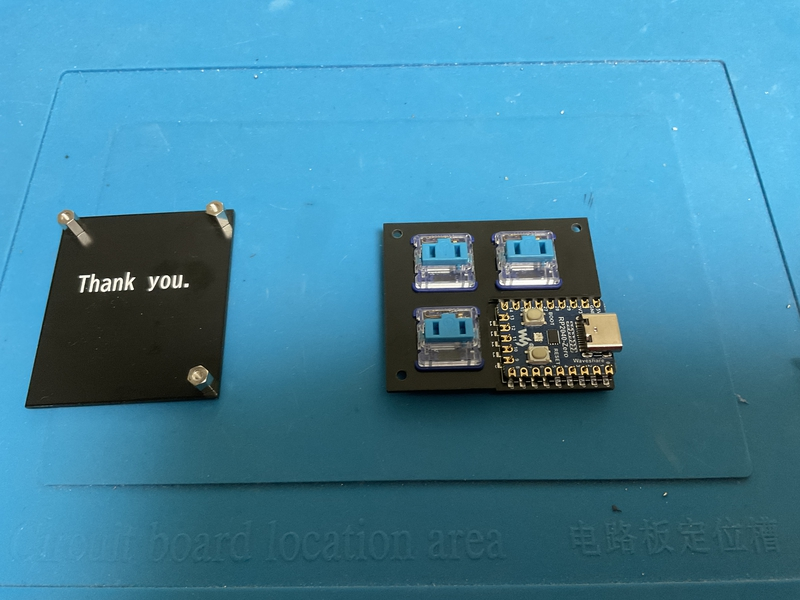
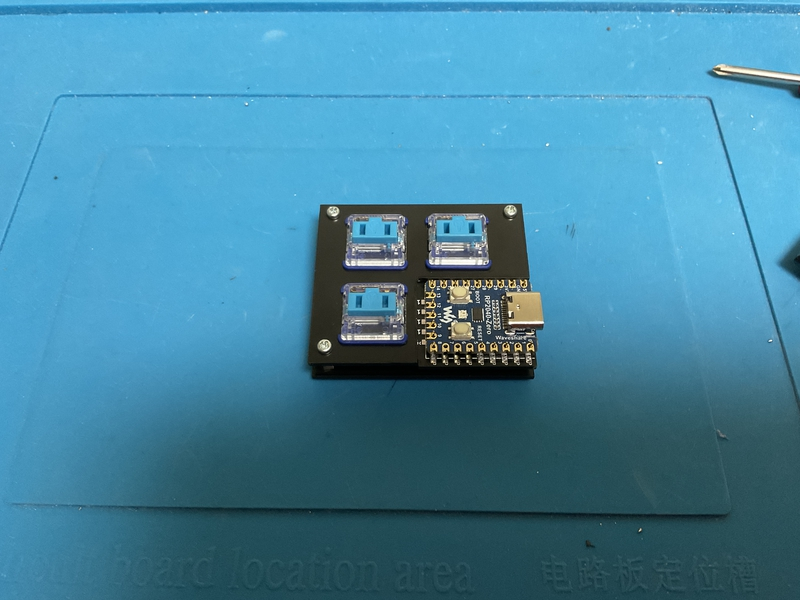

Place it on the bottom plate and fix the M2 screw (3mm) from the top of the switch plate.
 
ボトムプレートに乗せて、M２ネジ（3mm）をスイッチプレートの上面から固定してください。
 
 
Attach your favorite keycap, write the firmware, and you're done.
 
お好みのキーキャップをつけて、ファームウェアを書き込んで完成です。
 

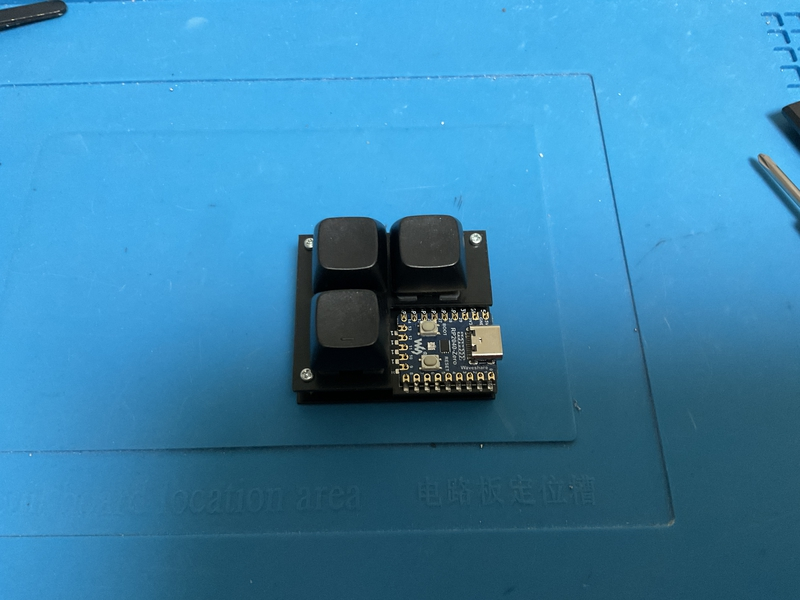
